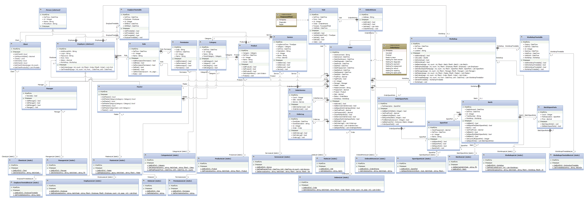

# UML
В данном репозитории собраны UML диаграммы для продукта с реализацией упрощенной работы ремонтного центра

Цель программы - автоматизация выполнения различных видов действий в центре по ремонту различной бытовой техники для повышения эффективности работы менеджеров, удобства мастеров и сбора статичстических значений для возможного перераспределения ресурсов центра. Данная программа позволяет вести учет сотрудников, удобную работу с клиентами и их техникой, управлять каталогом услуг, работать со складом деталей, а также быстро формировать и изменять заявки на ремонт. Можно выдвинуть следующие задачи, которое поможет решить данная программа:

<ul>
  <li>быстрое и простое формирование новых заявок и редактирование существующих</li>
  <li>отслеживание статуса заявки</li>
  <li>система лояльности для постоянных клиентов (расчет персональных скидок)</li>
  <li>управление списком сотрудников, в том числе формирование персонального расписания</li>
  <li>управление списком оказываемых услуг</li>
  <li>простая работа со складом запчастей и контроль закупок</li>
  <li>проведение анализа деятельности центра (формирование статистики</li>
  <li>повышение эффективности функционирования центра в целом</li>
</ul>

## Диаграмма классов

### Список классов
 - [Person](./descriptions/person.md "Класс Person")
 - [Client](./descriptions/client.md "Класс Client")
 - [Employee](./descriptions/employee.md "Класс Employee")
 - [Manager](./descriptions/manager.md "Класс Manager")
 - [Master](./descriptions/master.md "Класс Master")
 - [EmployeeTimetable](./descriptions/employeeTimetable.md "Класс EmployeeTimetable")
 - [Role](./descriptions/role.md "Класс Role")
 - [Permission](./descriptions/permission.md "Класс Permission")
 - [Category](./descriptions/category.md "Класс Category")
 - [Product](./descriptions/product.md "Класс Product")
 - [Service](./descriptions/service.md "Класс Service")
 - [Order](./descriptions/order.md "Класс Order")
 - [OrderServices](./orderServices.md "Класс OrderServices")
 - [OrderAtHome](./descriptions/orderAtHome.md "Класс OrderAtHome")
 - [Visit](./descriptions/visit.md "Класс Visit")
 - [SparePart](./descriptions/sparepart.md "Класс SparePart")
 - [OrderSpareParts](./descriptions/orderSpareparts.md "Класс OrderSpareParts")
 - [Batch](./descriptions/batch.md "Класс Batch")
 - [BatchSpareParts](./descriptions/batchSpareparts.md "Класс BatchSpareParts")
 - [Workshop](./descriptions/workshop.md "Класс Workshop")
 - [WorkshopTimetable](./descriptions/workshopTimetable.md "Класс WorkshopTimetalbe")
 - [SortingClasses (static)](./descriptions/staticLists.md "Статические классы сортировки")
