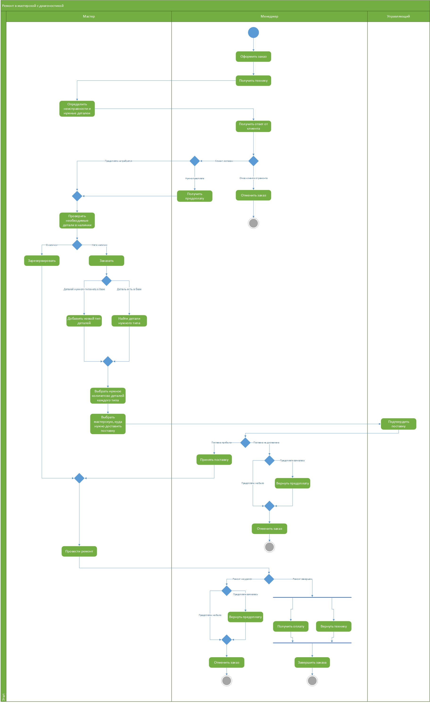

# UML
В данном репозитории собраны UML диаграммы для продукта с реализацией упрощенной работы ремонтного центра

Цель программы - автоматизация выполнения различных видов действий в центре по ремонту различной бытовой техники для повышения эффективности работы менеджеров, удобства мастеров и сбора статичстических значений для возможного перераспределения ресурсов центра. Данная программа позволяет вести учет сотрудников, удобную работу с клиентами и их техникой, управлять каталогом услуг, работать со складом деталей, а также быстро формировать и изменять заявки на ремонт. Можно выдвинуть следующие задачи, которое поможет решить данная программа:

<ul>
  <li>быстрое и простое формирование новых заявок и редактирование существующих</li>
  <li>отслеживание статуса заявки</li>
  <li>система лояльности для постоянных клиентов (расчет персональных скидок)</li>
  <li>управление списком сотрудников, в том числе формирование персонального расписания</li>
  <li>управление списком оказываемых услуг</li>
  <li>простая работа со складом запчастей и контроль закупок</li>
  <li>проведение анализа деятельности центра (формирование статистики</li>
  <li>повышение эффективности функционирования центра в целом</li>
</ul>

## Диаграмма прецедентов

## Диаграмма классов

### Список классов
 - Person - абстрактный класс, представляющий собой человека. От него наследуются Client и Employee
 - Client - класс, представляющий собой клиента сервисного центра
 - Employee - Абстрактный класс, представляющий собой работника сервисного центра. От него наследуются Manager и Master. У всего сотрудников есть расписание, которое можно получить с помощью метода GetTimetable(page : int, count : int, filterA : EmployeeTimetable, filterB : EmployeeTimetable) : List<EmployeeTimetable>
 - Manager - класс, представляющий собой менеджера сервисного центра
 - Master - класс, представляющий собой мастера сервисного центра. Мастеры разделяются по категориям техники, которую они могут умеют обслуживать. Для получения этих категорий предназначен метод GetMasterOrders(page : int, count : int, filterA : Order, filterB : Order) : List<Order>
 - EmployeeTimetable - класс, представляющий собой расписание работника
 - Role - класс, представляющий собой роль сотрудника. У каждой роли есть ряд разрешений Permission, которые вызываются с помощью метода GetPermissions(count : int, page : int) : List<Permission>. Сотруднику с данной ролью доступны действия, перечисленные в этой самой коллекции.
 - Permission - класс, представляющий собой определенное действие в система. С помощью этого класса вместе с Role регулируются права пользователей в система.
 - Category - класс, представляющий собой определенную категорию техники. Благодаря нему можно группировать технику Product клиентов и контролировать, может ли мастер Master обслужить ту или иную технику. В качестве одного из атрибутов содержит родительскую категорию, для выстраивания иерархии
 - Product - класс, представляющий собой технику клиента Client
 - Service - класс, представляющий собой оказываемую услугу. У услуги есть категория Category, к которой она относится. Время выполнения предназначено для примерного планирования времени выезда Visit, чтоб минимизировать вероятность конфликта выездов и опозданий.
 - [Order - класс, представляющий собой заказ на ремонт. Содержит коллекцию деталей OrderSpareParts и услуг OrderServices, которые можно получить методами GetSpareParts() : List<OrderSpareParts> и GetServices() : List<OrderServices> соответственно.
 - OrderServices - класс, связывающий услугу и заказ. Нужен для того, чтоб была возможность регулировать количество одной и той же услуги в заказе (например, замена двух конфорок на плите) и тонкой настройки скидки на конкретную услугу в заказе (например, акция на 100% скидку на диагностику)
 - OrderAtHome - класс, представляющий собой заказ на ремонт на дому. Наследуется от Order. Содержит коллекции визитов, которые можно получить методом GetVisits() : List<Visit>
 - Visit - класс, представляющий собой выезд на дом при заказе на дому
 - SparePart - класс, представляющий собой описание запчасти. Атрибут ClientPrepayment определяет, нужна ли предоплата в заказ, в которых требуется эта деталь
 - OrderSpareParts - класс, представляющий собой запчасть в заказе. Содержит словарь, в котором указанно, из какой поставки была взята запчасть и в каком количестве. Благодаря чему есть возможность выбрать, из каких конкретных поставок будет использована запчасть и в каком количестве. Если же такая тонкая настройка не требуется, то детали можно подобрать автоматически, вызвав метод FindBatchesAuto(count : Integer) : bool, указав, какое количество запчасть данного типа надо. Весь набор поставок можно получить с помощью метода GetBatchesInfo() : Dictionary<Batch, Integer>. Само описание детали хранится в атрибуте PartDescription
 - Batch - класс, представляющий собой поставку с деталями BatchSpareParts. Коллекцию деталей можно получить с помощью метода GetSpareParts() : List<BatchSpareParts>
 - [BatchSpareParts - класс, связывающий детали и поставку. Благодаря нему мы можем указать, какое количество деталей выбранного типа SparePart нужно заказ и цену на них (цена не хранить в самом класс SparePart, т.к. в разных поставках цена может отличаться)
 - Workshop - класс, представляющий собой мастерскую (филиал сервисного центра). Содержит в себе расписания работы филиала WorkshopTimetable, получаемые с помощью метода GetTimetables(page : int, count : int, filterA : WorkshopTimetable, filterB : WorkshopTimetable) : List<WorkshopTimetable>. Также содержит методы для получения работников филиала, прибывших поставок и запчастей в наличии
 - WorkshopTimetable - класс, представляющий собой расписание работы филиала. Т.к. расписание у филиалов меняется редко, оно хранится не на каждый день, а на промежутки времени. Атрибут ValidFrom показывает, с какого числа действует расписание, а ValidUntil до какого числа.
 - SortingClasses (static) - данные классы отвечают за сортировку экземпляров классов, а также в некоторых из них реализован расчет статических данных

## Диаграмма состояний

Описывает состояния заказа на ремонт и их причины изменений. В коде программы состояния хранятся в виде enumeration. Их можно просмотреть на [диаграмме классов](#диаграмма-классов)

## Диаграмма активностей

Описывает процесс выполнения заказа на ремонт в мастерской и разделение обязанностей

